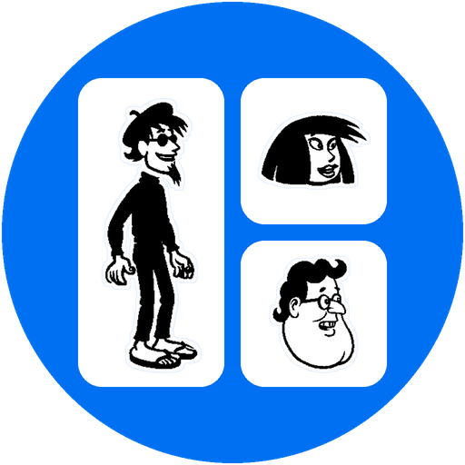

<div align="center">



<br />

<picture>
  <source media="(prefers-color-scheme: dark)" srcset="title-dark.png">
  <source media="(prefers-color-scheme: light)" srcset="title-light.png">
  
</picture>

### Multi-User Comic Strip Chat Client
*Decentralized P2P • End-to-End Encrypted • Microsoft Comic Chat Modernized*

[](LICENSE.txt)
[](docs/index.html)

</div>

---

AirComic is a multi-user, peer-coordinated, end-to-end encrypted chat application built with **React**, **HTML5 Canvas**, and **Material Design (MUI)**. It recreates and modernizes the classic **Microsoft Comic Chat** engine, automatically generating dynamic comic strips with characters, speech/thought/whisper balloons, and emotional poses directly from conversation streams.

Everything gets bundled into a single `index.html` file that you can drop on any static web server and pull up in your browser. You can try it out here:

[https://eglass1.github.io/air-comic/](https://eglass1.github.io/air-comic/)


---

## 📜 History

This is a small, fun side project. I was experimenting with peer-to-peer web messaging and looking for something I could test drive Google Antigravity CLI with. I started out with "AirThread", just a regular text-based web chat thing, but saw that Microsoft Comic Chat was open sourced about a month ago, and figured I could incorporate that. Go check it out:

[https://microsoft.github.io/comic-chat/](https://microsoft.github.io/comic-chat/)

I used Antigravity to "port" the comic stuff in (really, reimplement as TypeScript based on source code examination); it took maybe half an hour to get a rough initial thing working, then a few hours of back-and-forth tweaking (correcting color mapping for the non-monochrome items, and bubble placement which still is kind of a rough approximation, and simple UI feature stuff).

---

## 🎨 Microsoft Comic Chat Features

- **Automated Comic Strip Generation**: Real-time generation of multi-panel comic book layouts with speech balloons, thought clouds, whisper dashes, and narrative action boxes (`/me`, `/think`, `/whisper`, `/shout`).
- **Authentic Artwork & Binary Parser**:
  - Full TypeScript parser for Microsoft Comic Chat `.avb` (Avatar Binary) and `.bgb` (Backdrop Binary) formats.
  - Decompresses zlib deflate streams (`pako`) and decodes 1-bit, 2-bit masked monochrome (with aura knockout halos), 4/8-bit paletted, and 24/32-bit DIB bitmaps.
  - Dynamically composites complex avatars (matching torso and facial expression deltas with origin offsets and layering flags) and simple avatars.
  - Includes all 31 original MS Comic Chat characters (Armando, Susan, Tux, Connor, Denise, Hugh, Jordan, Kirby, Lance, Lynnea, Mike, Tiki, Veronica, Xeno, etc.) and 9 backdrops.
- **Emotion Wheel & Live Pose Preview**:
  - Interactive 8-sector emotion wheel (Happy, Coy, Bored, Scared, Sad, Angry, Shout, Laugh) with variable intensity and neutral center.
  - Gesture quick-pick bar (Wave, Point at Other, Point at Self, Shrug).
  - Real-time facial expression and pose canvas preview as you adjust the wheel.
- **Natural Language Emotion Heuristics**: Automatic emotion detection based on text sentiment, smileys, exclamation marks, all-caps shouts, laughs, greetings, and pronouns.
- **View Mode Switcher**: Seamlessly switch between the dynamic Comic Strip view and classic transcript text view with smooth auto-scrolling and high-DPI scaling.
- **Light Mode by Default**: Modern clean theme with light mode default and dark mode support.

---

## 🔒 Security & Peer-to-Peer Encryption

- **P2P Mesh WebRTC (Trystero)**: Ephemeral decentralized networking over WebRTC with Nostr/BitTorrent relay signaling.
- **Dual Cryptographic Keypair Architecture**:
  - **RSA-OAEP 2048-bit**: Asymmetric public-key encryption for AES-256-GCM conversation keys.
  - **ECDSA P-256**: Digital signatures for authenticating identity hellos, rekeys, join requests, and room actions.
- **Channel Governance & Rekeying**:
  - Proactive friend addition and entry request/approval workflow with cryptographic verification.
  - Group participant removal with instant rekey exclusion.
- **IndexedDB Persistence**: Local storage for user profiles, keypairs, friends directory, and conversation logs.

---

## 📦 Building and Running

```bash
# Install dependencies
npm install

# Build standalone HTML bundle (output: docs/index.html)
npm run build

# Start development server
npm run dev
```

Open [`docs/index.html`](docs/index.html) directly or host it on any static web server (such as GitHub Pages).
